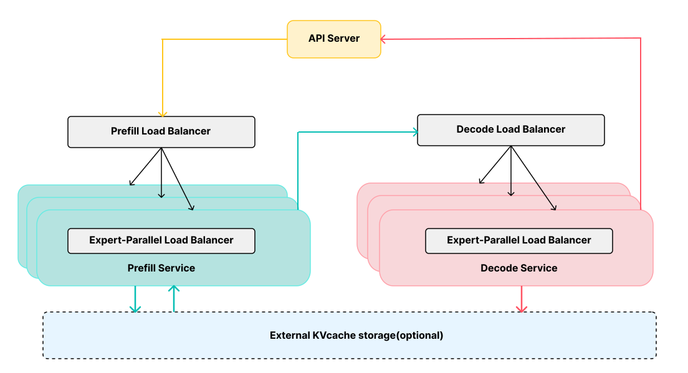
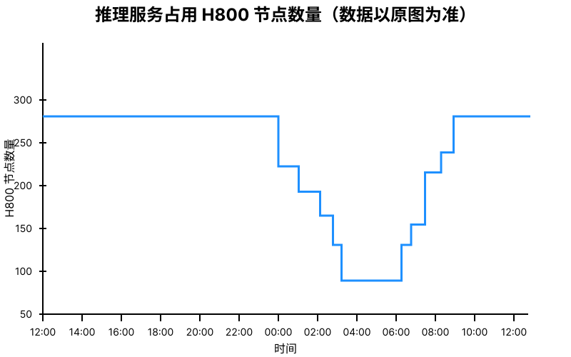
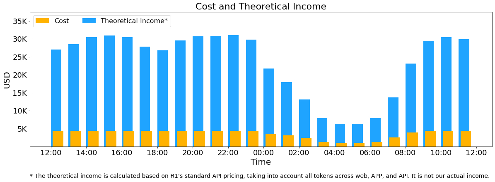

# 开源周第六天：再谈 DeepSeek-V3/R1 推理系统

> [英文原文](https://github.com/deepseek-ai/open-infra-index/blob/main/202502OpenSourceWeek/day_6_one_more_thing_deepseekV3R1_inference_system_overview.md)

## 系统设计原则

DeepSeek-V3/R1 推理（Inference，简单说就是给用户用）服务的目标是：**更高吞吐，更低延迟。**

为实现这两个目标，我们采用了跨节点专家并行 (Expert Parallelism，EP) 方案。

*   首先，EP 显著扩大了 batch size，提升 GPU 矩阵运算效率，从而提高吞吐。
*   其次，EP 将专家分散到多张 GPU 上，每张 GPU 只需处理一小部分专家 (减少内存访问需求)，由此降低延迟。

然而，EP 也增加了系统复杂性，主要体现在两个方面：

1.  EP 引入了跨节点通信。为了优化吞吐，必须设计合理的计算流程，使通信与计算重叠。
2.  EP 涉及多个节点，因此天然需要数据并行 (DP)，并需要在不同 DP 实例间进行负载均衡。

本文重点介绍我们如何通过以下方式应对这些挑战：

*   利用 EP 扩大 batch size；
*   将通信延迟隐藏在计算之下；
*   执行负载均衡。

### 大规模跨节点专家并行 (EP)

DeepSeek-V3/R1 专家数量庞大——每层 256 个专家中仅激活 8 个——模型的超高稀疏性要求极大的全局 batch size。这确保了每个专家有足够的 batch size，从而实现更高的吞吐和更低的延迟。大规模跨节点 EP 至关重要。

由于我们采用了 prefill-decode 解耦架构，因此在 prefill 和 decode 阶段采用了不同程度的并行性：

*   **Prefill 阶段 [Routed Expert EP32, MLA/Shared Expert DP32]**：每个部署单元跨越 4 个节点，包含 32 个冗余路由专家，每张 GPU 处理 9 个路由专家和 1 个共享专家。
*   **Decoding 阶段 [Routed Expert EP144, MLA/Shared Expert DP144]**：每个部署单元跨越 18 个节点，包含 32 个冗余路由专家，每张 GPU 管理 2 个路由专家和 1 个共享专家。

### 计算-通信重叠

大规模跨节点 EP 带来了显著的通信开销。为缓解这个问题，我们采用双 batch 重叠策略来隐藏通信成本，并通过将一个 batch 的请求拆分为两个 microbatch 来提高整体吞吐。在 prefill 阶段，这两个 microbatch 交替执行，一个 microbatch 的通信成本被另一个 microbatch 的计算所掩盖。

在 decoding 阶段，不同阶段的执行时长不均衡。因此，我们将 attention 层细分为两个步骤，并使用 5 阶段流水线来实现无缝的通信-计算重叠。

更多关于我们的通信-计算重叠机制的细节，请访问 https://github.com/deepseek-ai/profile-data。

### 实现最优负载均衡

大规模并行 (包括 DP 和 EP) 带来了一个关键挑战：如果单张 GPU 计算或通信负载过重，就会成为性能瓶颈，拖慢整个系统，而其他 GPU 则处于空闲状态。为了最大限度地利用资源，我们力求平衡所有 GPU 上的计算和通信负载。

#### 1. Prefill 负载均衡器

*   关键问题：不同 DP 实例间的请求数量和序列长度各异，导致 core-attention 计算和 dispatch send 负载不均。
*   优化目标：
    *   平衡 GPU 间的 core-attention 计算 (core-attention 计算负载均衡)。
    *   均衡每张 GPU 的输入 token 数量 (dispatch send 负载均衡)，防止特定 GPU 处理时间过长。

#### 2. Decode 负载均衡器

*   关键问题：不同 DP 实例间的请求数量和序列长度不均，导致 core-attention 计算 (与 KVCache 使用量相关) 和 dispatch send 负载差异。
*   优化目标：
    *   平衡 GPU 间的 KVCache 使用量 (core-attention 计算负载均衡)。
    *   均衡每张 GPU 的请求数量 (dispatch send 负载均衡)。

#### 3. 专家并行负载均衡器

*   关键问题：对于给定的 MoE 模型，存在固有的高负载专家，导致不同 GPU 上的专家计算工作负载不平衡。
*   优化目标：
    *   平衡每张 GPU 上的专家计算 (即，最小化所有 GPU 中的最大 dispatch receive 负载)。

### DeepSeek 在线推理系统示意图

### DeepSeek 在线服务统计数据

所有 DeepSeek-V3/R1 推理服务均在 H800 GPU 上提供，精度与训练保持一致。具体来说，矩阵乘法和 dispatch 传输采用与训练对齐的 FP8 格式，而 core MLA 计算和 combine 传输则使用 BF16 格式，以确保最佳服务性能。

此外，考虑到白天服务负载高，夜间负载低，我们实施了一种机制，在白天高峰时段将推理服务部署到所有节点。在夜间低负载时段，我们减少推理节点，并将资源分配给研发和训练。在过去 24 小时内 (UTC+8 2025 年 2 月 27 日 12:00 PM 至 2025 年 2 月 28 日 12:00 PM)，V3 和 R1 推理服务的节点占用峰值达到 278 个，平均占用 226.75 个节点 (每个节点包含 8 张 H800 GPU)。假设单张 H800 GPU 的租用成本为每小时 2 美元，则每日总成本为 87,072 美元。

在 24 小时的统计周期内 (UTC+8 2025 年 2 月 27 日 12:00 PM 至 2025 年 2 月 28 日 12:00 PM)，V3 和 R1：

*   总输入 token 数：608B，其中 342B token (56.3%) 命中磁盘 KV 缓存。
*   总输出 token 数：168B。平均输出速度为每秒 20–22 个 token，每个输出 token 的平均 kvcache 长度为 4,989 个 token。
*   每张 H800 节点在 prefill 期间平均吞吐量约为 73.7k token/s 输入 (包括缓存命中)，或在 decoding 期间平均吞吐量约为 14.8k token/s 输出。

以上统计数据包括来自 Web、APP 和 API 的所有用户请求。如果所有 token 都按 DeepSeek-R1 的定价[^*] 收费，则每日理论收入为 562,027 美元，成本利润率为 545%。

[^*]: R1 定价：输入 token (缓存命中) 0.14 美元/M，输入 token (缓存未命中) 0.55 美元/M，输出 token 2.19 美元/M。

然而，我们的实际收入远低于此，原因如下：

*   DeepSeek-V3 的定价远低于 R1，
*   只有一部分服务实现了商业化 (Web 和 APP 访问仍然免费)，
*   夜间折扣在非高峰时段自动应用。

