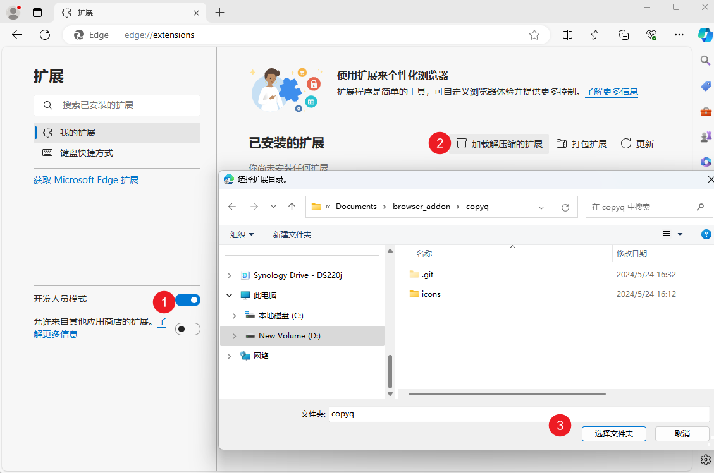
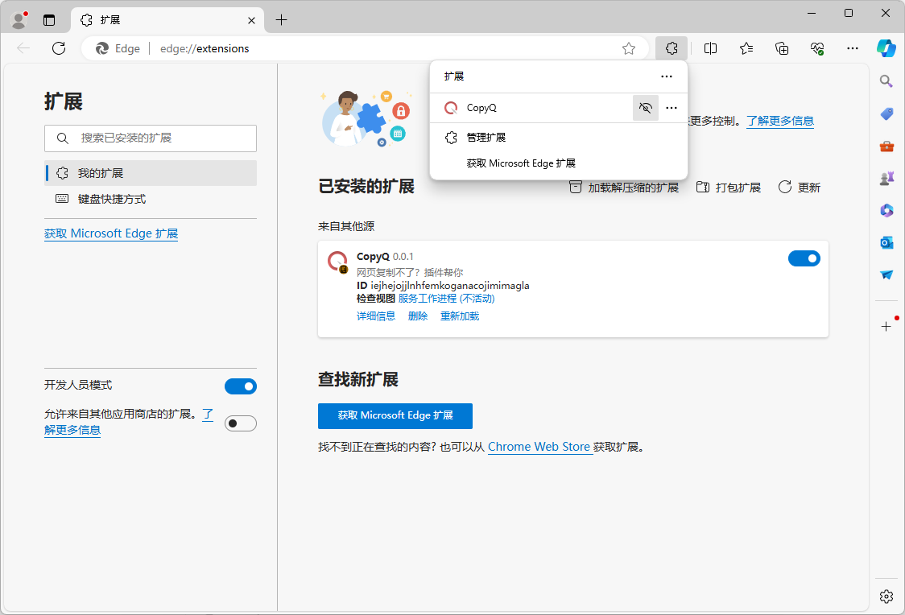

# 课前准备：下载并加载模板

## 下载模板

到[copyq](https://gitee.com/jianqiu_huang/copyq)仓库下载模板代码压缩包，或者直接点击[这个链接](https://gitee.com/jianqiu_huang/copyq/repository/archive/master.zip)。

将里面的 `icons`、`manifest.json`、`service_worker.js` 复制粘贴到一个文件夹下。本文后续假设项目文件夹是`D:\Documents\browser_addon\copyq`

## Edge 的插件管理

如果你原本的浏览器插件很多，建议先创建一个「个人资料」，方便操作、排除干扰。目前最新版的 Edge，点击左上角头像，便可以创建：

:::info 不同版本的Edge会有所不同
本教程用的版本是 125.0.2535.51 (正式版本) (64 位)
:::

### 进入拓展界面与开发人员模式

有两种方式，一种是点击右上角菜单，选择“扩展”按钮：

再选择“管理拓展”，会进入`edge://extensions/`页面，注意“开发人员模式”选项要选上，图里是默认情况，没有选的：

第二种方式就是在地址栏直接输入`edge://extensions/`，回车键就能跳转。（由于安全原因，URL链接则不能跳转）

### 初次加载开发中拓展

1. 确认“开发人员模式”选项已开；
2. 左侧会有“加载解压缩的扩展”按钮，单击它；
3. 选择包含扩展源文件的目录，这里是`D:\Documents\browser_addon\copyq`。选好后单击“选择文件夹”按钮。

加载后效果图：

### 更新或删除开发拓展

点击对应按钮即可。本教程不引入自动更新的框架，更新按钮会比较常用到。

### 将拓展放到工具栏

插件安装后，要手动加到状态栏。还是先点击右上角菜单，选择“扩展”按钮：

在右上角弹出的插件管理栏中，点击眼睛的图标。

> 顺带一提，考虑到大部分用户不会更改默认设置、一个小小的工具栏可能有几十个插件在抢，可想而知工具栏这东西有多鸡肋。大头应该放在后续的context跟sidepanel。

## 测试插件功能 {#test}

这个插件模板，只包含一个开关逻辑，就是你点击它在工具栏的图标，它图标下方就有个蓝底白字的“ON”，再点一次就取消。

## 用于测试插件的网页

另外你可以提前检查一下后续测试插件功能网页的国内访问性：

- [版本1](/software/WE/test/copy/version1)
- [版本2](/software/WE/test/copy/version2)
- [版本3](/software/WE/test/copy/version3)
- [版本4](/software/WE/test/copy/version4)

如果访问性有问题，可以考虑到[Gitee的议题区](https://gitee.com/jianqiu_huang/copyq/issues)报问题。
