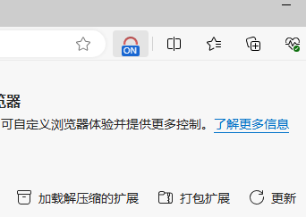

# 模板代码解释

这个插件很简单，适合作为新手研究的切入点。它只包含一个开关逻辑，就是你点击它在工具栏的图标，它图标下方就有个蓝底白字的“ON”，再点一次就取消。



:::info 下载、加载相关
如果你还没有下载代码模板，详见：[课前准备：下载并加载模板](environment.md)
:::

## 元数据文件

看一个插件的代码，首先看它的“元数据文件”，也就是`manifest.json`。粗看起来很多，但名字（name）、描述（description）、版本（version）、图标（icons）跟代码本身不强相关，可以暂时忽略、不动。

```json
{
  "name": "CopyQ",
  "description": "网页复制不了？插件帮你",
  "action": {
    "default_title": "点击开启复制模式"
  },
  "manifest_version": 3,
  "version": "0.0.1",
  "permissions": [
    "activeTab",
    "scripting"
  ],
  "background": {
    "service_worker": "service_worker.js"
  },
  "icons": {
    "16": "icons/copyq@16.png",
    "32": "icons/copyq@32.png",
    "48": "icons/copyq@48.png",
    "128": "icons/copyq@128.png"
  }
}
```

也就是说，先集中看：

```json
{
  "action": {
    "default_title": "点击开启复制模式"
  },
  "manifest_version": 3,
  "permissions": [
    "activeTab",
    "scripting"
  ],
  "background": {
    "service_worker": "service_worker.js"
  },
}
```

- `action`是用来控制工具栏图标行为的，其下的`default_title`表示悬停在图标时显示的标题；
- `manifest_version`也可以先不管，它是这份元数据文件（manifest）的版本，不同版本的文件格式要求、插件权限有所不同，但 Chrome 跟 Edge 只认 3 这个版本。之前一直是版本 2 的 [Firefox 也在迁移了](https://blog.mozilla.org/addons/2024/03/13/manifest-v3-manifest-v2-march-2024-update/)；
- `permissions`是插件要申请的权限，不同权限代表着浏览器提供的不同应用接口（API）。`activeTab`能临时访问当前活跃的标签页[^1]，配合执行脚本的`scripting`权限，插件可以在这些网站上插入脚本；
- `background`是后台脚本。可以用来沟通各个界面、处理跨域网络请求等。“worker”是在程序中执行特定任务的线程，`service_worker`在Edge被翻译成「服务工作进程」，这里的后台脚本是`service_worker.js`。

## 后台脚本

如果你读过谷歌的中文文档，它有时有叫“背景脚本”，这是机翻的问题。

言归正传，看看`service_worker.js`的代码：

```js
const on = 'ON';

chrome.action.onClicked.addListener(async (tab) => {
    // 获取当前标签页徽章（Badge）的文本
    let text = await chrome.action.getBadgeText({ tabId: tab.id });
    // 打开（ON）的时候就关掉（空字符），关闭的时候就打开。
    if (text === on) {
        text = ''
    } else {
        text = on;
    }
    // 设置当前标签页徽章（Badge）的文本
    chrome.action.setBadgeText({ tabId: tab.id, text: text });
});
```

整体就是把工具栏的图标做成一个开关，开的时候徽章为“ON”，关的时候没有徽章（徽章没有字），

- `chrome.action`就是控制工具栏行为的`api`；
- `onClicked.addListener`为鼠标单击这一事件添加监听函数，输入为标签页对象（浏览器控制输入）；
- 徽章（Badge）文本控制的API，可参考[文档](https://developer.chrome.google.cn/docs/extensions/reference/api/action?hl=zh-cn#badge)（注意机翻的“徽章”跟“标记”都有可能是 Badge;

## 阅读代码与编写的差别

写代码其实比读代码难很多。比方说，现在让你把上面的代码擦掉，自己写一个开关的逻辑，就算你对上面的方案有印象，就算你借助了人工智能 ChatGPT，也没有那么容易——可能花很多时间在向 ChatGPT 描述问题上，而 ChatGPT 不一定对。

这个很像做数学题，上课听讲、都会，下来一做、不对。

再讨论细一点，怎么知道徽章（Badge）相关API呢？勤快一点就翻文档，偷懒一点就问 ChatGPT。但前提是你起码要知道有 Badge 这个概念，这或许也就是教程的作用，从“没有概念”到有一些，从有一些到有很多……

下一篇会开始编写代码。

[//]: # (解决难题，像走出一片森林。一开始不知道自己能不能走出来，最后不一定能走出来，)

## 关于犯错

对新手，问题比较多大的是，很多地方不能错一个字符，比如“icons”写成了“icon”……

对于这点，个人有一些经验，后续有空细讲：

1. 学习的时候主动犯错，故意弄坏代码，看看会发生什么。除了提前积累错误经验，还能让你明白备份的重要性；
2. 写一点代码，就看一下效果，这能免去很多定位错误的时间。有的人一下子写一坨代码，写爽了才跑一下，然后排查、定位错误要花几倍时间；
3. “被动”犯错之后立马自我排查，效果远不如：
   1. 休息一会再来；
   2. 让别人（或 AI）检查。

[^1]: [“activeTab”权限  | Chrome Extensions (google.cn)](https://developer.chrome.google.cn/docs/extensions/develop/concepts/activeTab?hl=zh-cn)
[^2]: 徽章


