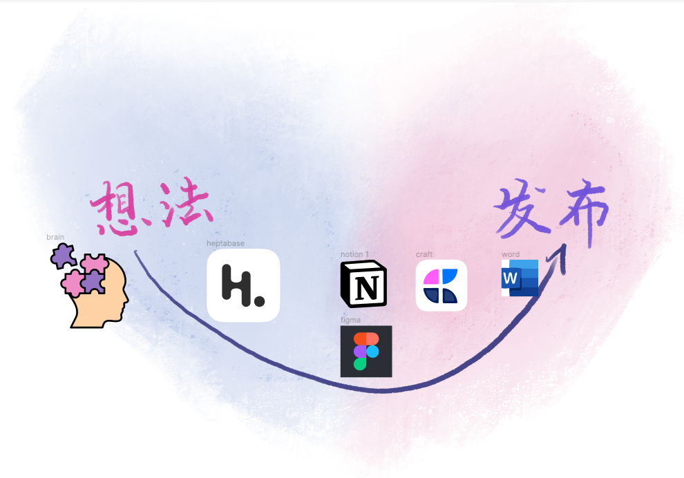
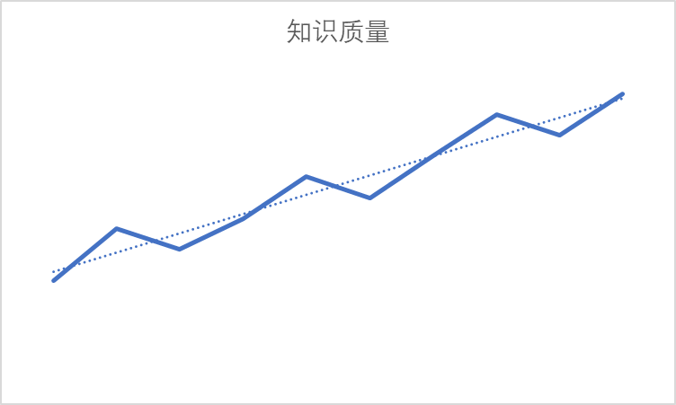
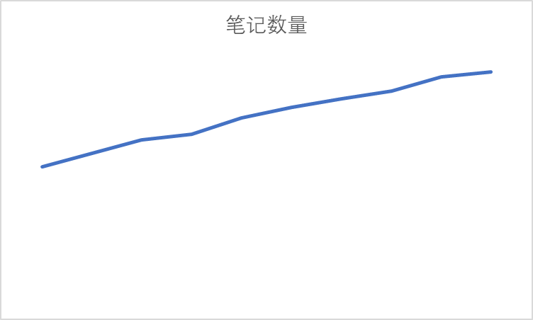
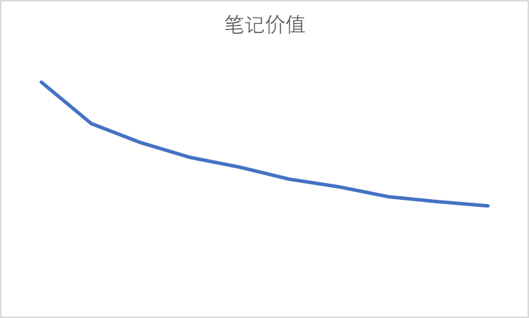

# 用过众多笔记软件，发现个人“笔记库”可能没有什么用

[//]: # (TODO title, image)

[//]: # (我去年8月写过一些，比如《个人“笔记库”可能没有什么用》https://www.gantrol.com/software/tools/notes/too-much/)

[//]: # ()
[//]: # (再如：热衷于笔记的人，可能非常关注笔记的“长期价值”。可是，笔记就该立刻发挥作用：)

[//]: # (1. 促进思考，理顺思路)

[//]: # (2. 输出作为输入，形成一种“自反馈”。)

[//]: # ()
[//]: # (类比一下，要更多地训练大脑皮层这个大模型，而不是准备提示库。)

笔记软件未免太多了，浮墨、飞书、印象……不少还只有英文名，什么Craft、Notion、Nobility、Roam Research、Heptabase……

本人体验过十几款笔记软件，粗略分起来，可能有几类：

1. 备忘、收藏为主，随时随地记录。代表是浮墨、苹果自带笔记、印象笔记。Cubox专攻收藏，但好像不叫“笔记”软件；
2. 还原纸笔体验，如Good Notes，Nobility；
3. 研究为主。代表有Roam Research、Obsidian、Heptabase。它们都采用日志随时记录，然后当天“萃取”知识卡片的形式，Heptabase还有知识地图功能，能将各类卡片、日志放到一块面板上；
4. 展示或协作为主，代表有Notion、飞书、Craft。“发布渠道”其实非常重要。飞书、Notion站点发布即网站页面本身。没有其他复杂的界面，也没有复杂的备案手续。实际上，这恐怕是盈利点最大的“笔记”软件，除了它不太像笔记之外，没啥可说的。

问题是，“笔记”应该是什么？“好的”笔记又是什么？

- 好看的？配上各种图，最好能贴到社交媒体上吸引关注；
- 大而全的？巴不得将互联网的资料全部下载，恨不得将老师的话全录起来；
- 有“长期价值”的？把笔记组织得井井有条，还是直接收藏文章就好？

可惜，“笔记库”可能没有什么用。

时代是在发展的，个人的知识质量也在波动上升。比如清朝学乘法很费劲，现在起码有乘法口诀表。小时候学乘法很费劲，现在哪还用看笔记。

现在假设笔记库中的笔记数量线性波动上升：

而很明显的，笔记价值往往随时间下降：

这就导致了一个问题，笔记库中，价值低的笔记越来越多，占比越来越大。

而如果你想维持笔记库可用性，必须持续投入精力，不然笔记库一段时间就不如外面的，就该“入坟”了。

看看网上组织得很好的文档库，人家甚至是有专门团队编写的。如果网上有资料，那么为什么要以个人之力，去弄一个质量远远跟不上的“笔记库”呢？

如果回答不上这个问题，那么可能没有弄一个新笔记库的必要。

由于损失厌恶，笔记用户会更喜欢“永久存储”、“永久买断”的东西，可惜热力学定律不同意，可能只有死亡那一刻真的“永久”了吧。

有人可能想着，这是为未来做准备啊。对于学习，其实笔记的价值曲线已经回答了这个问题了——笔记一开始的价值最高。

你辛辛苦苦搭建几个月笔记库，然后发现，外面往往有更好的文章或方案了，这真的在为未来做准备吗？

笔记库的死亡时刻，不是被磁盘删除了，而是它居然不如搜索引擎或生成式AI好用。

假设你认为未来知识质量会上升，“长期存储笔记”，对你个人并不重要。要学的东西，你应当现在就去学，笔记应当当天就有用，而不只是未来有用。

至此，个人学习笔记的问题简化为：有没有一套笔记框架，能灵活处理当天笔记，然后留下回忆的“钩子”，以供日后复习。

这会是一段时间的课题。

再次强调，“发布”、“美观”、“协作”的需求应该也挺高的，但我怀疑这些跟“笔记库”也没什么关系。

跟“笔记库”有关的可能是“事实”或“记录”，但大部分人貌似不太关心。
